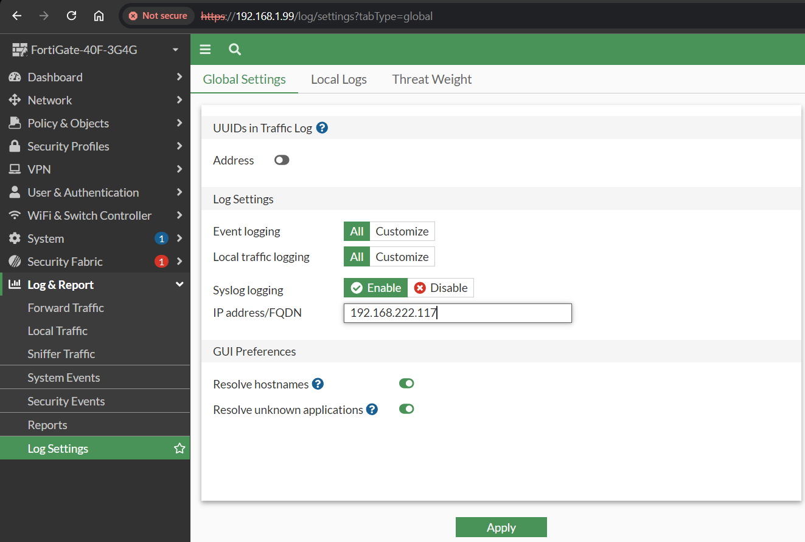
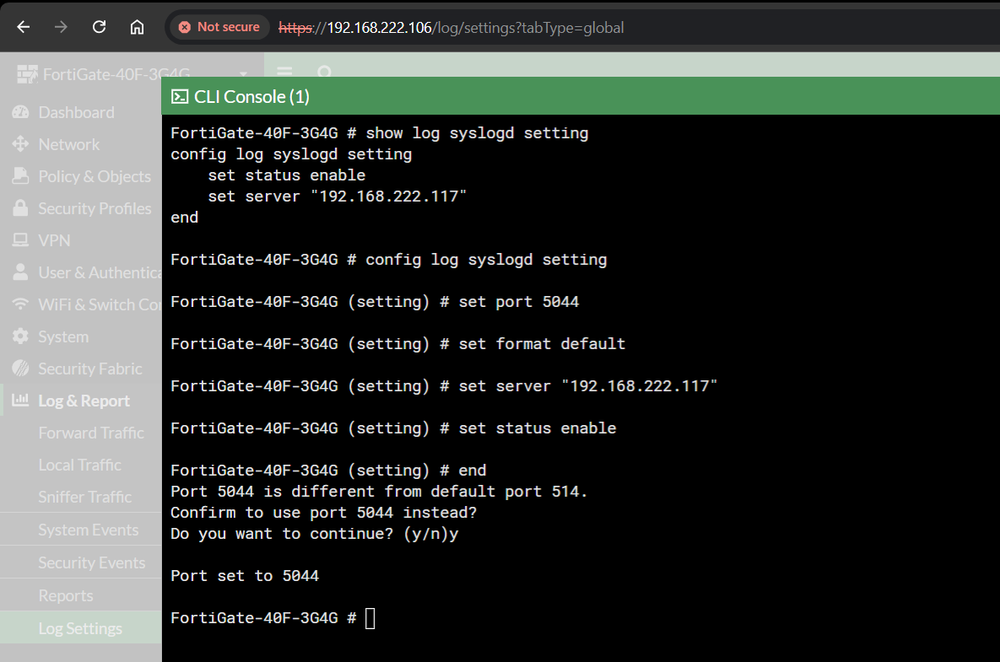
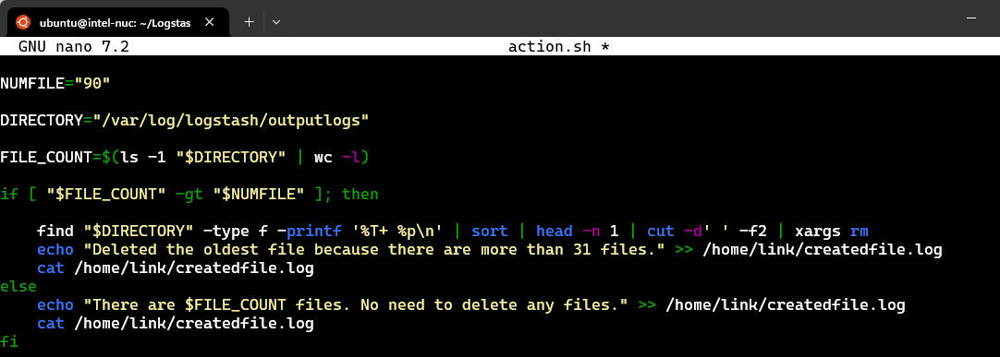
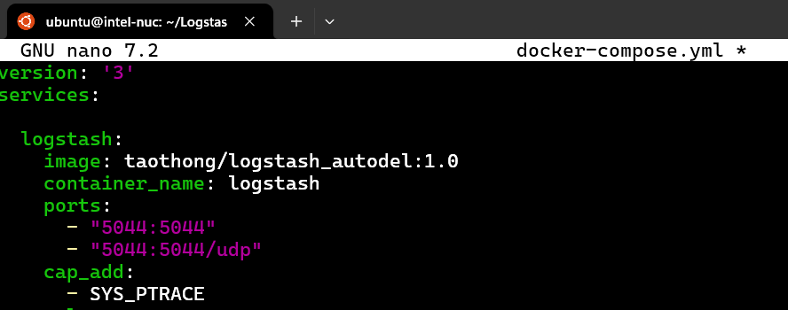

# How to install ?
   #### step 1 install docker and git
   
- sudo apt install docker -y 
- sudo apt install git -y 

#### step 2 clone project to your server

- git clone https://github.com/Taothong98/Logstash_Autodel_in_Docker.git 

#### step 3 run docker in project

- cd Logstash_Autodel_in_Docker
- sudo docker-compose up -d

#### step 4 Check service
#### You can check whether container start with this command 

- sudo docker ps -a

# Config FortiGate for send log to logstash

####  command

- [ ] show log syslogd setting
- [ ] config log syslogd setting 
    - [ ] set port 5044
    - [ ] set format default
    - [ ] set server "200.0.0.200"
    - [ ] set status enable
	- [ ] end
	
	
#### You can cheak output in this dirctory

- cd outputlogs/

# Optional

##### Customs number of file

###### If you want to configure the number of files, you can do so in the action.sh file by modifying the NUMFILE parameter
###### The default parameter is 90 file

- nano dev/action.sh

##### Customs port and Input
###### You can customs port for receive syslog in logstash.conf and docker-compose.yml files. 

###### In logstash.conf you can config other output also
- nano logstash.conf

- nano docker-compose.yml

	

	